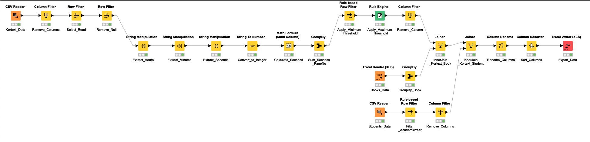
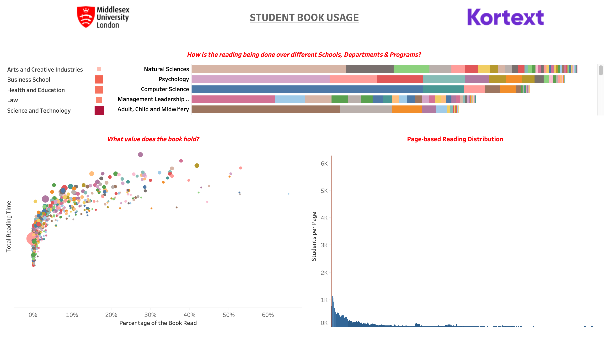
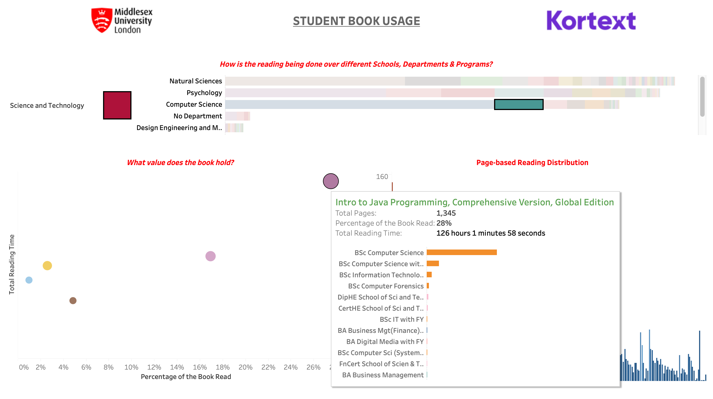
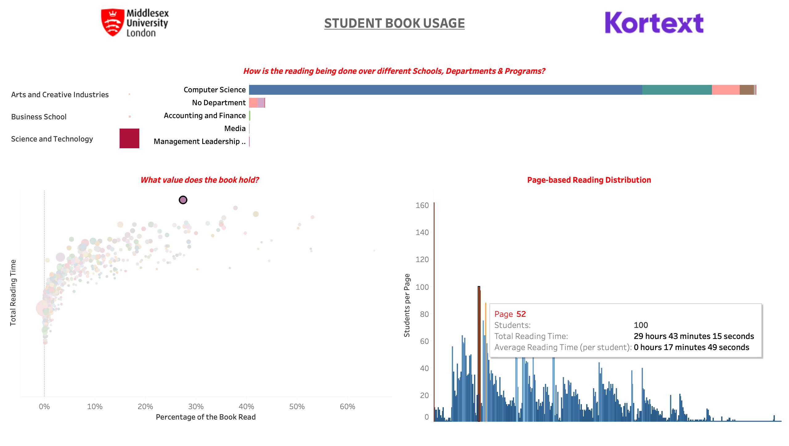

# Kortext Platform Usage at Middlesex University, London (Tableau Dashboard)
An interactive data visualisation dashboard built using Tableau software to understand the value of digital resources issued on Kortext platform at Middlesex University, London.

_Developed as a part of the coursework for the module CST4055 Data Visualisation at Middlesex University, London during the academic year 2019-20._

## Data
Almost 2 million rows of raw data spread over 20 million cells was pre-processed using KNIME software to clean it and make it efficient for error-free and smooth visualisation.

## Visualisation
The primary question ‘What value does the book hold?’ can be answered specifically using the interactivity in this dashboard. The dashboard can be used in multiple ways to look at the value of books using different lenses. The interactivity of the dashboard allows the user to filter and specify selection as per their needs.

### Dashboard Overview

### Program Filter

### Book Filter

